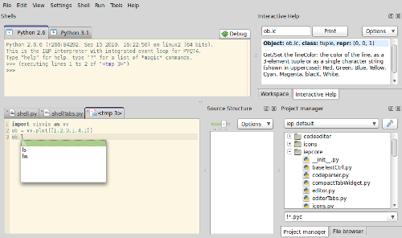

===========
Screenshots
===========

.. Note:: Some screenshots may be of previous versions of Pyzo.

----

Below is a shot of Pyzo on Windows7 that illustrates several things: 
  * One can see how multiple shells (of different python versions) are active simultaneously. 
  * Also visible are the interactive help, which updates as the user scrolls through the auto-completion list.
  * The source structure tool displays the structure of the source, which is very helpful for larger source files.
  * The auto-completion list shows information obtained from parsing the source code, as well as from the shell, by figuring out inheritance. 
  * Files can be loaded easily using the project manager tool.
  * Temporary files can be created to quickly try new ideas.

.. image:: _static/screenshots/thumb00_win.png
    :align: center
    :target: _static/screenshots/screen00_win.png

----

This screenshot (using the GTK+ theme on my laptop running Linux Mint) illustrates how Pyzo tries to obtain the documentation of properties (for the interactive help tool). One can see how ``line.lc`` is a tuple, but the documentation is of the property. 

----

The screenshot below illustrates post-mortem debugging using a simple example. 

Pressing the "Debug button at the upper right corner of the shell initiates post mortem debugging (but this can also done using the magic command "db start"). The button then gets a menu, in which the stack frames are shown. Clicking on an item makes the shell go to that stack frame so that the variables can be examined (for example using "whos"). The line where it went wrong is highlighted in the editor.

The workspace tool (upper right) shows the variables in the currently active stack frame.

.. image:: _static/screenshots/thumb02_linux.png
    :align: center
    :target: _static/screenshots/screen02_linux.png

----

This one shows a calltip. Calltip information is obtained both from the active shell as from functions defined in the source. 

It also shows the file browser tool, which has been used to search for files containing the word 'Axes('.

.. image:: _static/screenshots/thumb04_linux.png
    :align: center
    :target: _static/screenshots/screen04_linux.png

----

Pyzo with the Oxygen theme on KDE.

.. image:: _static/screenshots/thumb05_kde.png
    :align: center
    :target: _static/screenshots/screen05_kde.png

----

Pyzo on OS X.

.. image:: _static/screenshots/thumb06_osx.png
    :align: center
    :target: _static/screenshots/screen06_osx.png
