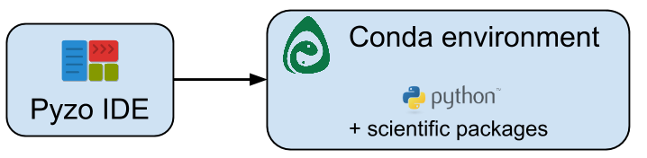

.. _quickstart:

=========================
Getting started with Pyzo
=========================

You’re just a couple of minutes away from doing scientific computing in Python!
To get started with Pyzo, you need three things:
    
* The Pyzo IDE: provides an application to write your code.
* A Python environment: provides a Python interpreter to run your code.
* Scientific packages: provides visualization, computation, etc.

Install the Pyzo IDE
--------------------

Here are links to download Pyzo for
`Pyzo Windows (64 bit) <xxx.exe>`_ ,
`Pyzo OS X (64 bit) <hxxx-x86_64.sh>`_ , and
`Pyzo Linux (64 bit) <xxxx86_64.sh>`_ .
For more downloads see the :ref:`download page <downloads>`.
(It does not matter in what order you install the environment and the
IDE.)

Install a Python environment
----------------------------

To run Python code, you need a Python interpreter.
Pyzo works with most Python interpreters, but
we recommend installing `miniconda <http://conda.pydata.org/miniconda.html>`_,
or `anaconda <https://www.continuum.io/downloads>`_ if you intend to do science,
because these make it very easy to install additional (scientific) packages.
Make sure to use Python 3, and not Python 2.

Here are links to download miniconda for
`miniconda Windows (64 bit) <https://repo.continuum.io/miniconda/Miniconda-latest-Windows-x86_64.exe>`_ ,
`miniconda OS X (64 bit) <https://repo.continuum.io/miniconda/Miniconda-latest-MacOSX-x86_64.sh>`_ , and
`miniconda Linux (64 bit) <https://repo.continuum.io/miniconda/Miniconda-latest-Linux-x86_64.sh>`_ .
We recommend using the default location, or at least a location that can be written
to without admin privileges, so that addtional packages can be installed.

Manually specify an interpreter
-------------------------------

You can usually skip this step, because in most cases the
environment is automatically detected. If this is not the case
(e.g. it was not installed in a default location),
just open the shell configuration dialog (menu > shell > edit shell configuration), 
and set the value of "exe" to the path of the Python executable.

Install Scientific packages
---------------------------

With bare Python, you cannot do much science yet. Fortunately, you can
easily manage the conda environment from inside the IDE. In the shell,
type:

.. code-block:: none
    
    conda install scipy

Hooray, you just installed a new package! Now type:

.. code-block:: none
    
    conda install pyqt matplotlib pandas sympy
    
Now you have the most important scientific Python packages (a.k.a. the scipy-stack).
If you need a package that is not yet installed, and conda does not
work, see :ref:`this guide <install>`.

Further steps
-------------

You should now be set up to start coding! You can also learn more about
:ref:`using the IDE <guide>` and about :ref:`using Python <learn>`.
